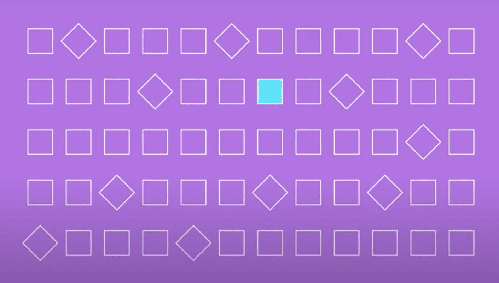

If you are building a UI in isolation, the tool you use should also preview your UI in 
isolation. The more isolation of your preview the better. When your tool previews
your stories in isolation, you have more power.

Monarch previews your stories inside their own dedicated window. 
With Monarch, all you see in the
preview are your widgets, nothing else. Monarch also runs your stories
inside their own Flutter app. The Monarch controls are in a separate application running in 
a separate memory space. 

We believe that Monarch needs to run your stories in the best isolation possible. 
We have designed Monarch around this belief. Some of these design choices were
hard. They meant more work for us. And we are so happy we chose this path.

Other tools don't preview your stories in isolation. Other tools preview your stories
alongside other controls. Thus, your preview is surrounded by code and inside widgets 
that are not yours. This approach creates problems and limitations for you.

Since Monarch gives you the best isolation possible, here is a list of things you can do with Monarch that you can’t do with other tools:

- You can have stories that launch dialogs, modals, etc.
- You can write stories that do navigation and routing.
- You can see guidelines and baselines.
- You can slow down your animations.
- You can detect images that are too big.
- You become more productive by visually debugging.
- You can easily debug the source code of your stories.
- You can reuse your stories from your widget tests.
- Etc.

And, as we add more features to Monarch, you will be able to do more things that
other tools won't be able to do.

When it comes to building Flutter UIs, isolation is the way.
