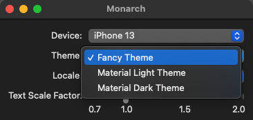

If you have a non-trivial Flutter app, then you probably use a custom theme. 
Monarch can render your stories using your app's custom theme. To do so, Monarch 
needs to know about your theme via the `MonarchTheme` annotation. 

## Annotate your custom theme
1. Add the `package:monarch_annotations` to your dependencies:
```yaml
dependencies:
  monarch_annotations: ^0.0.12
``` 

2. Go to the dart file where you have declared the `ThemeData` variable 
for you custom theme. 
If you have created your theme in an in-line expression, then you would have
to refactor it into a top-level variable. Once you have identified your 
`ThemeData` variable, add the `MonarchTheme` annotation as shown below:
```dart
import 'package:monarch_annotations/monarch_annotations.dart';
...

@MonarchTheme('Fancy Theme')
final fancyTheme = ThemeData(...);
```

3. Save your changes. The Monarch app will display the theme you annotated in the 
Theme dropdown. When you select that theme, the selected story will render using
your custom theme.



## Multiple themes
If you have multiple themes in your app, you can annotate all of them with the 
`MonarchTheme` annotation. You could also declare one of them as the default. 
The default theme is the theme that Monarch will use when it first loads.

```dart
import 'package:monarch_annotations/monarch_annotations.dart';
...

@MonarchTheme('Fancy Light Theme')
final fancyLightTheme = ThemeData(...);

@MonarchTheme('Fancy Dark Theme', isDefault: true)
final fancyDarkTheme = ThemeData(...);

```
